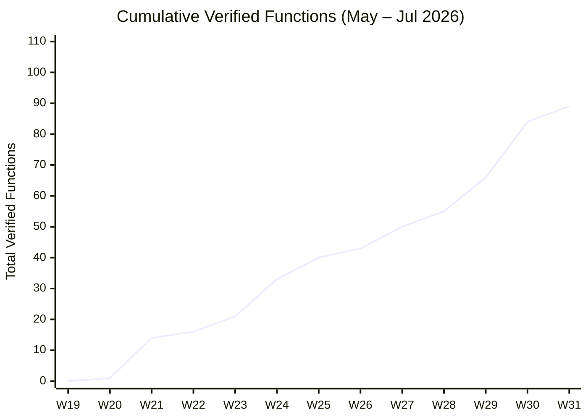
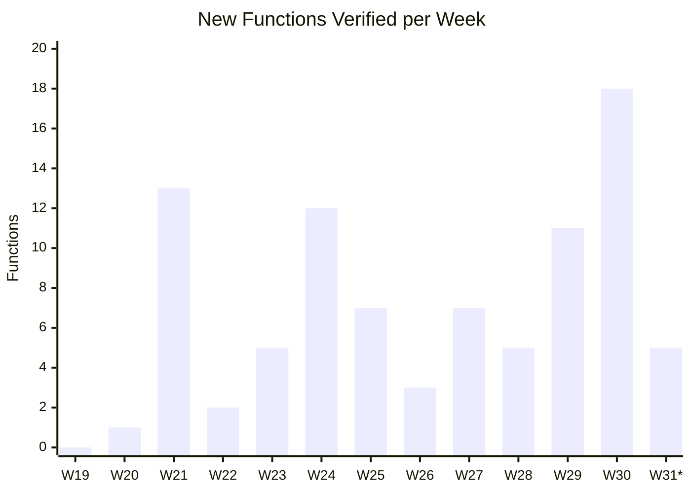
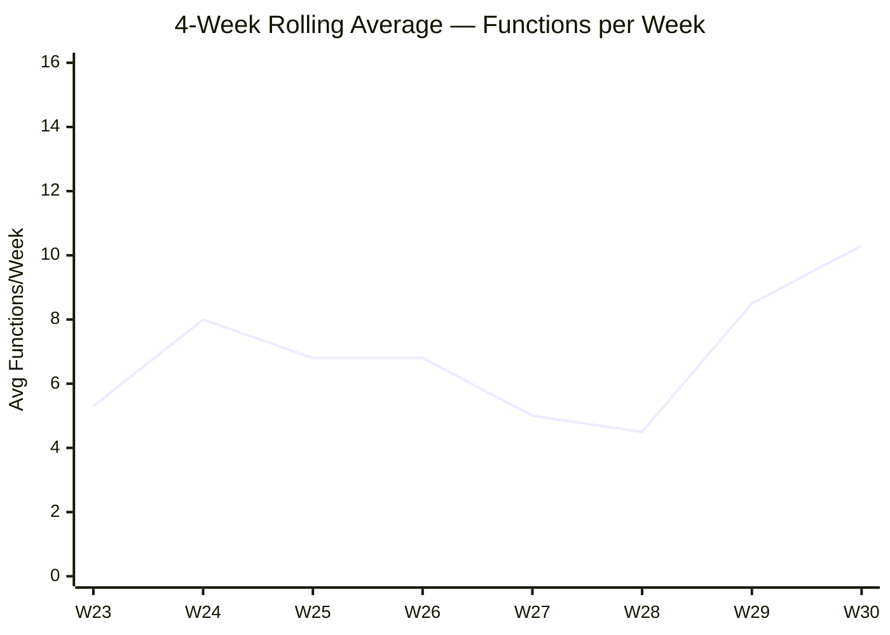

# SparsePostQuantumRatchet-verify — Project Status Report

**Date**: July 29, 2026
**Repository**: [Beneficial-AI-Foundation/SparsePostQuantumRatchet-verify](https://github.com/Beneficial-AI-Foundation/SparsePostQuantumRatchet-verify)
**Report period**: May 4 – July 29, 2026 (13 weeks)

---

## Executive Summary

The SPQR formal-verification effort has verified **89 Rust functions** in Lean 4
over the past three months, accelerating from ~2 functions/week in the early
ramp-up phase to **10+ functions/week** in the most recent month.  Only **3
`sorry` axioms** remain in the specification layer (across 2 files).  48 open
issues track the remaining work, including 30 functions still awaiting
specification and verification and several extraction-level blockers.

---

## 1. Verified Functions — Cumulative Progress

### 1.1 Weekly Data

| Week | Date Range | New | Cumulative | Module Focus |
|:----:|:----------:|:---:|:----------:|:-------------|
| W19 | May 4–10 | 0 | 0 | Infrastructure & CI |
| W20 | May 11–17 | 1 | 1 | `gf.rs` (reduce) |
| W21 | May 18–24 | 13 | 14 | `gf.rs` (GF16 core ops) |
| W22 | May 25–31 | 2 | 16 | `gf.rs` (mul/mul_assign) |
| W23 | Jun 1–7 | 5 | 21 | `gf.rs` (div chain, parallel_mult) |
| W24 | Jun 8–14 | 12 | 33 | `polynomial.rs` (constants, Poly basics) |
| W25 | Jun 15–21 | 7 | 40 | `polynomial.rs` + `authenticator` |
| W26 | Jun 22–28 | 3 | 43 | `polynomial.rs` (Lagrange prep) |
| W27 | Jun 29–Jul 5 | 7 | 50 | `polynomial.rs` + `authenticator` |
| W28 | Jul 6–12 | 5 | 55 | `polynomial.rs` (encoder) |
| W29 | Jul 13–19 | 11 | 66 | `polynomial.rs` + `serialize.rs` |
| W30 | Jul 20–26 | 18 | 84 | Multi-module sprint |
| W31 | Jul 27–29 *(partial)* | 5 | **89** | `polynomial.rs` + `serialize.rs` |

### 1.2 Cumulative Progress Chart (3-Month Timeline)



### 1.3 Weekly New Verifications



*\*W31 is a partial week (2 days as of this report).*

### 1.4 ASCII Fallback — Cumulative Progress

For environments that do not render Mermaid:

```
Verified Functions (cumulative)
100 ┤
 90 ┤                                                              ╭── 89
 80 ┤                                                        ╭─────╯
 70 ┤                                                  ╭─────╯
 60 ┤                                            ╭─────╯
 50 ┤                                 ╭──────────╯
 40 ┤                       ╭─────────╯
 30 ┤                 ╭─────╯
 20 ┤           ╭─────╯
 10 ┤     ╭─────╯
  0 ┤─────╯
    └──┬──┬──┬──┬──┬──┬──┬──┬──┬──┬──┬──┬──
      W19 W20 W21 W22 W23 W24 W25 W26 W27 W28 W29 W30 W31
      May              Jun              Jul
```

---

## 2. Growth Rate Analysis

| Metric | Value |
|:-------|------:|
| Total verified functions | **89** |
| Overall average (13 weeks) | **6.8 /week** |
| Last 4 full weeks (W27–W30) | **10.3 /week** |
| Last 2 full weeks (W29–W30) | **14.5 /week** |
| Peak week (W30, Jul 20–26) | **18** |
| Remaining `sorry` axioms | **3** (in 2 files) |

**Trend**: The weekly rate has been accelerating. The first month (W19–W23)
averaged **4.2 functions/week** during the GF16 ramp-up. The second month
(W24–W27) averaged **7.3 functions/week** as polynomial verification hit
stride. The third month (W28–W31) is averaging **12.7 functions/week** across
multiple modules concurrently.



---

## 3. Projections — Week of Jul 27 – Aug 2 (W31)

| Scenario | Projected New (W31) | Projected Cumulative |
|:---------|:-------------------:|:--------------------:|
| Conservative (match W28 pace) | 10 | **94** |
| Baseline (4-wk avg ≈ 10) | 12 | **96** |
| Optimistic (sustain W30 pace) | 16 | **100** |

**Basis**: W31 already has 5 functions verified in 2 days (Jul 28–29), on pace
for ~12–15 for the full week at the current daily rate of ~2.5.  Weekend
contributions are historically lower.

**Milestone watch**: The project is likely to cross **100 verified functions**
within 1–2 weeks.

### Upcoming verification targets (from open issues, likely W31–W32)

| # | Function | Module |
|---|----------|--------|
| 363 | `Poly::from_complete_points` | `polynomial.rs` |
| 314 | `decode_chunk` | `v1/chunked/states/serialize.rs` |
| 262 | `PolyDecoder::add_chunk` | `polynomial.rs` |
| 260 | `PolyDecoder::from_pb` | `polynomial.rs` |
| 263 | `PolyDecoder::decoded_message` | `polynomial.rs` |
| 255 | `PolyEncoder::next_chunk` | `polynomial.rs` |

---

## 4. Module Coverage Breakdown

| Source Module | Verified | Remaining (open issues) | Status |
|:--------------|:--------:|:-----------------------:|:------:|
| `encoding/gf.rs` | 19 | 0 | ✅ Complete |
| `encoding/polynomial.rs` | 49 | 10 | 🟡 ~83% |
| `util.rs` | 3 | 0 | ✅ Complete |
| `authenticator.rs` | 5 | 4 | 🟡 ~56% |
| `serialize.rs` | 3 | 3 | 🟡 ~50% |
| `v1/chunked/states/serialize.rs` | 8 | 5 | 🟡 ~62% |
| `incremental_mlkem768.rs` | 2 | 5 | 🔴 ~29% |
| `encoding.rs` | 0 | 5 | 🔴 Not started |
| `kdf.rs` / `chain.rs` | 0 | — | ⛔ Blocked (extraction) |

### Proof Health

| Indicator | Count |
|:----------|------:|
| Spec files (`Spqr/Specs/**/*.lean`) | **112** |
| Files with remaining `sorry` | **2** |
| Total `sorry` count | **3** |

The 3 remaining `sorry` axioms are in:
- `Spqr/Specs/Encoding/Polynomial/ConstPolysToPolys.lean` (2) — tracked by [#357](https://github.com/Beneficial-AI-Foundation/SparsePostQuantumRatchet-verify/issues/357)
- `Spqr/Specs/Encoding/Polynomial/LagrangePolysForCompletePoints.lean` (1) — tracked by [#272](https://github.com/Beneficial-AI-Foundation/SparsePostQuantumRatchet-verify/issues/272)

---

## 5. Outstanding Issues

There are **48 open issues** on the upstream repository. They are categorized below.

### 5.1 Verification Tasks — Functions (30 issues)

These are the remaining "Specify and verify" issues, grouped by module:

<details>
<summary><strong>encoding/polynomial.rs</strong> (10 functions)</summary>

| # | Function |
|---|----------|
| [#363](https://github.com/Beneficial-AI-Foundation/SparsePostQuantumRatchet-verify/issues/363) | `Poly::from_complete_points` |
| [#135](https://github.com/Beneficial-AI-Foundation/SparsePostQuantumRatchet-verify/issues/135) | `Poly::from_complete_points` (original) |
| [#263](https://github.com/Beneficial-AI-Foundation/SparsePostQuantumRatchet-verify/issues/263) | `PolyDecoder::decoded_message` |
| [#262](https://github.com/Beneficial-AI-Foundation/SparsePostQuantumRatchet-verify/issues/262) | `PolyDecoder::add_chunk` |
| [#260](https://github.com/Beneficial-AI-Foundation/SparsePostQuantumRatchet-verify/issues/260) | `PolyDecoder::from_pb` |
| [#255](https://github.com/Beneficial-AI-Foundation/SparsePostQuantumRatchet-verify/issues/255) | `PolyEncoder::next_chunk` |
| [#221](https://github.com/Beneficial-AI-Foundation/SparsePostQuantumRatchet-verify/issues/221) | `PolyEncoder::into_pb_test` |
| [#220](https://github.com/Beneficial-AI-Foundation/SparsePostQuantumRatchet-verify/issues/220) | `PolyEncoder::chunk_at` |
| [#218](https://github.com/Beneficial-AI-Foundation/SparsePostQuantumRatchet-verify/issues/218) | `PolyEncoder::point_at` |

</details>

<details>
<summary><strong>authenticator.rs</strong> (4 functions)</summary>

| # | Function |
|---|----------|
| [#16](https://github.com/Beneficial-AI-Foundation/SparsePostQuantumRatchet-verify/issues/16) | `Authenticator::new` |
| [#191](https://github.com/Beneficial-AI-Foundation/SparsePostQuantumRatchet-verify/issues/191) | `Authenticator::update` |
| [#192](https://github.com/Beneficial-AI-Foundation/SparsePostQuantumRatchet-verify/issues/192) | `Authenticator::verify_ct` |
| [#193](https://github.com/Beneficial-AI-Foundation/SparsePostQuantumRatchet-verify/issues/193) | `Authenticator::verify_hdr` |

</details>

<details>
<summary><strong>serialize.rs</strong> (3 functions)</summary>

| # | Function |
|---|----------|
| [#295](https://github.com/Beneficial-AI-Foundation/SparsePostQuantumRatchet-verify/issues/295) | `Error::Display::fmt` |
| [#294](https://github.com/Beneficial-AI-Foundation/SparsePostQuantumRatchet-verify/issues/294) | `Error::Debug::fmt` |

</details>

<details>
<summary><strong>v1/chunked/states/serialize.rs</strong> (5 functions)</summary>

| # | Function |
|---|----------|
| [#314](https://github.com/Beneficial-AI-Foundation/SparsePostQuantumRatchet-verify/issues/314) | `decode_chunk` |
| [#315](https://github.com/Beneficial-AI-Foundation/SparsePostQuantumRatchet-verify/issues/315) | `Message::serialize` |
| [#316](https://github.com/Beneficial-AI-Foundation/SparsePostQuantumRatchet-verify/issues/316) | `Message::deserialize` |
| [#317](https://github.com/Beneficial-AI-Foundation/SparsePostQuantumRatchet-verify/issues/317) | `States::into_pb` |
| [#318](https://github.com/Beneficial-AI-Foundation/SparsePostQuantumRatchet-verify/issues/318) | `States::from_pb` |

</details>

<details>
<summary><strong>incremental_mlkem768.rs</strong> (5 functions)</summary>

| # | Function |
|---|----------|
| [#169](https://github.com/Beneficial-AI-Foundation/SparsePostQuantumRatchet-verify/issues/169) | `ek_matches_header` |
| [#171](https://github.com/Beneficial-AI-Foundation/SparsePostQuantumRatchet-verify/issues/171) | `encaps1` |
| [#172](https://github.com/Beneficial-AI-Foundation/SparsePostQuantumRatchet-verify/issues/172) | `encaps2` |
| [#173](https://github.com/Beneficial-AI-Foundation/SparsePostQuantumRatchet-verify/issues/173) | `potentially_fix_state` |
| [#175](https://github.com/Beneficial-AI-Foundation/SparsePostQuantumRatchet-verify/issues/175) | `decaps` |

</details>

<details>
<summary><strong>encoding.rs</strong> (5 functions — Option&lt;T&gt; Encoder/Decoder)</summary>

| # | Function |
|---|----------|
| [#162](https://github.com/Beneficial-AI-Foundation/SparsePostQuantumRatchet-verify/issues/162) | `Option<T>::encode_bytes` |
| [#163](https://github.com/Beneficial-AI-Foundation/SparsePostQuantumRatchet-verify/issues/163) | `Option<T>::next_chunk` |
| [#164](https://github.com/Beneficial-AI-Foundation/SparsePostQuantumRatchet-verify/issues/164) | `Option<T>::Decoder::new` |
| [#165](https://github.com/Beneficial-AI-Foundation/SparsePostQuantumRatchet-verify/issues/165) | `Option<T>::add_chunk` |
| [#166](https://github.com/Beneficial-AI-Foundation/SparsePostQuantumRatchet-verify/issues/166) | `Option<T>::decoded_message` |

</details>

### 5.2 Module-Level Verification Milestones (6 issues)

| # | Module | Depends On |
|---|--------|:----------:|
| [#124](https://github.com/Beneficial-AI-Foundation/SparsePostQuantumRatchet-verify/issues/124) | `encoding/polynomial.rs` | 10 functions |
| [#15](https://github.com/Beneficial-AI-Foundation/SparsePostQuantumRatchet-verify/issues/15) | `authenticator.rs` | 4 functions |
| [#290](https://github.com/Beneficial-AI-Foundation/SparsePostQuantumRatchet-verify/issues/290) | `serialize.rs` | 2 functions |
| [#160](https://github.com/Beneficial-AI-Foundation/SparsePostQuantumRatchet-verify/issues/160) | `encoding.rs` | 5 functions |
| [#306](https://github.com/Beneficial-AI-Foundation/SparsePostQuantumRatchet-verify/issues/306) | `v1/chunked/states/serialize.rs` | 5 functions |
| [#168](https://github.com/Beneficial-AI-Foundation/SparsePostQuantumRatchet-verify/issues/168) | `incremental_mlkem768.rs` | 5 functions + ML-KEM models |

### 5.3 Extraction & Tooling Blockers (5 issues)

| # | Issue | Severity |
|---|-------|:--------:|
| [#104](https://github.com/Beneficial-AI-Foundation/SparsePostQuantumRatchet-verify/issues/104) | Extraction problem: `kdf::hkdf_to_slice` | 🔴 Blocks `kdf.rs` |
| [#103](https://github.com/Beneficial-AI-Foundation/SparsePostQuantumRatchet-verify/issues/103) | Extraction problem: `polynomial::decoded_message` | 🟡 Workaround exists |
| [#102](https://github.com/Beneficial-AI-Foundation/SparsePostQuantumRatchet-verify/issues/102) | Extraction: self-referential field names | 🟡 Aeneas upstream |
| [#101](https://github.com/Beneficial-AI-Foundation/SparsePostQuantumRatchet-verify/issues/101) | Extraction: `spqr::send` via `chain.Chain` | 🔴 Blocks `chain.rs` |
| [#281](https://github.com/Beneficial-AI-Foundation/SparsePostQuantumRatchet-verify/issues/281) | Root cause: "No Goals to Be Solved" with `3#usize` | 🟡 Aeneas upstream |

### 5.4 Specification & Proof (5 issues)

| # | Issue | Type |
|---|-------|:----:|
| [#44](https://github.com/Beneficial-AI-Foundation/SparsePostQuantumRatchet-verify/issues/44) | Prove chain & state machine invariants (PROP-9,14,17,21,26,30,33,39) | Proof |
| [#277](https://github.com/Beneficial-AI-Foundation/SparsePostQuantumRatchet-verify/issues/277) | Model incremental ML-KEM primitives with Hoare-style axioms | Spec |
| [#248](https://github.com/Beneficial-AI-Foundation/SparsePostQuantumRatchet-verify/issues/248) | Fully specify `from_seed` behavioral properties | Spec |
| [#340](https://github.com/Beneficial-AI-Foundation/SparsePostQuantumRatchet-verify/issues/340) | e2e PoC for FC + protocol models | Proof |
| [#245](https://github.com/Beneficial-AI-Foundation/SparsePostQuantumRatchet-verify/issues/245) | Generalise `libcrux_hmac` tag length axiom | Spec |

### 5.5 Infrastructure & Documentation (4 issues)

| # | Issue |
|---|-------|
| [#305](https://github.com/Beneficial-AI-Foundation/SparsePostQuantumRatchet-verify/issues/305) | Upstream various improvements to Aeneas |
| [#304](https://github.com/Beneficial-AI-Foundation/SparsePostQuantumRatchet-verify/issues/304) | Rust docs with per-function Lean verification panels |
| [#45](https://github.com/Beneficial-AI-Foundation/SparsePostQuantumRatchet-verify/issues/45) | Revert Rust setup workaround in Aeneas workflow |
| [#43](https://github.com/Beneficial-AI-Foundation/SparsePostQuantumRatchet-verify/issues/43) | Add property catalog and spec coverage analysis |

### 5.6 Bug Fixes & Technical Debt (3 issues)

| # | Issue | Priority |
|---|-------|:--------:|
| [#357](https://github.com/Beneficial-AI-Foundation/SparsePostQuantumRatchet-verify/issues/357) | Temporary `sorry` in `collect` specification bridge | 🔴 High |
| [#272](https://github.com/Beneficial-AI-Foundation/SparsePostQuantumRatchet-verify/issues/272) | Fix omitted `y` field in `lagrange_polys_for_complete_points` record update | 🔴 High |
| [#48](https://github.com/Beneficial-AI-Foundation/SparsePostQuantumRatchet-verify/issues/48) | Evaluate `collectAxioms` audit vs probe-lean sorry detection | 🟡 Medium |

---

## 6. Risk Summary

| Risk | Impact | Mitigation |
|:-----|:------:|:----------:|
| Charon extraction blockers (`kdf.rs`, `chain.rs`) | High — blocks protocol-level proofs | Aeneas upstream work ([#305](https://github.com/Beneficial-AI-Foundation/SparsePostQuantumRatchet-verify/issues/305)); alternative `cfg`-gated code paths |
| Remaining `sorry` axioms (3) | Medium — weakens proof guarantees | Actively tracked in [#357](https://github.com/Beneficial-AI-Foundation/SparsePostQuantumRatchet-verify/issues/357) and [#272](https://github.com/Beneficial-AI-Foundation/SparsePostQuantumRatchet-verify/issues/272) |
| ML-KEM primitives require cryptographic models | High — incremental_mlkem768 completion blocked | [#277](https://github.com/Beneficial-AI-Foundation/SparsePostQuantumRatchet-verify/issues/277) defines modeling approach |
| Chain/state machine invariants not yet proven | High — protocol-level assurance deferred | [#44](https://github.com/Beneficial-AI-Foundation/SparsePostQuantumRatchet-verify/issues/44) tracks 8 properties |

---

## 7. Appendix — Verified Functions List

<details>
<summary>Click to expand full list of 89 verified functions</summary>

| # | Date | Function | PR |
|:-:|:----:|:---------|:--:|
| 1 | May 13 | `gf::reduce::reduce_from_byte` | #31 |
| 2 | May 19 | `gf::reduce::reduce_bytes` | #41 |
| 3 | May 19 | `gf::reduce::poly_reduce` | #49 |
| 4 | May 19 | `gf::reduce::REDUCE_BYTES` | #49 |
| 5 | May 19 | `gf::unaccelerated::mul` | #50 |
| 6 | May 20 | `gf::unaccelerated::mul2` | #53 |
| 7 | May 20 | `gf::sub_assign` | #58 |
| 8 | May 20 | `gf::GF16::const_sub` | #59 |
| 9 | May 20 | `gf::GF16::ZERO` | #60 |
| 10 | May 20 | `gf::GF16::ONE` | #61 |
| 11 | May 20 | `gf::GF16::new` | #62 |
| 12 | May 21 | `gf::GF16::const_mul` | #64 |
| 13 | May 21 | `gf::GF16::const_div` | #72 |
| 14 | May 28 | `gf::mul_assign` | #91 |
| 15 | May 29 | `gf::mul` | #92 |
| 16 | Jun 4 | `gf::div_impl` | #98 |
| 17 | Jun 5 | `gf::div_assign` | #118 |
| 18 | Jun 5 | `gf::div` | #119 |
| 19 | Jun 5 | `gf::mul2_u16` | #122 |
| 20 | Jun 5 | `gf::parallel_mult` | #123 |
| 21 | Jun 8 | `polynomial::Poly::zero` | #138 |
| 22 | Jun 8 | `polynomial::MAX_INTERMEDIATE_POLYNOMIAL_DEGREE_V1` | #140 |
| 23 | Jun 9 | `polynomial::MAX_STORED_POLYNOMIAL_DEGREE_V1` | #147 |
| 24 | Jun 9 | `util::inz` | #155 |
| 25 | Jun 10 | `polynomial::Poly::lagrange_interpolate_complete` | #156 |
| 26 | Jun 10 | `util::is_non_zero` | #167 |
| 27 | Jun 11 | `polynomial::CHUNK_SIZE` | #179 |
| 28 | Jun 11 | `polynomial::NUM_POLYS` | #182 |
| 29 | Jun 11 | `polynomial::PolyConst::ZEROS` | #184 |
| 30 | Jun 11 | `util::compare` | #187 |
| 31 | Jun 12 | `polynomial::Poly::mult_xdiff_assign_trailing` | #186 |
| 32 | Jun 14 | `polynomial::Poly::add_assign` | #200 |
| 33 | Jun 15 | `polynomial::Poly::mult_assign` | #205 |
| 34 | Jun 15 | `authenticator::Authenticator::MACSIZE` | #198 |
| 35 | Jun 15 | `polynomial::Poly::serialize` | #206 |
| 36 | Jun 16 | `polynomial::Poly::deserialize` | #208 |
| 37 | Jun 16 | `authenticator::Authenticator::into_pb` | #222 |
| 38 | Jun 17 | `polynomial::Poly::compute_at` | #224 |
| 39 | Jun 17 | `authenticator::Authenticator::from_pb` | #223 |
| 40 | Jun 24 | `polynomial::Poly::clone` | #239 |
| 41 | Jun 24 | `polynomial::Poly::lagrange_interpolate_prepare` | #229 |
| 42 | Jun 24 | `polynomial::Poly::lagrange_sum` | #240 |
| 43 | Jun 29 | `polynomial::PolyConst::mult` | #244 |
| 44 | Jul 1 | `polynomial::Poly::lagrange_interpolate_pt` | #241 |
| 45 | Jul 2 | `polynomial::PolyConst::mult_xdiff` | #246 |
| 46 | Jul 2 | `authenticator::Authenticator::mac_ct` | #247 |
| 47 | Jul 3 | `polynomial::PolyConst::lagrange_interpolate_pt` | #253 |
| 48 | Jul 3 | `authenticator::Authenticator::mac_hdr` | #250 |
| 49 | Jul 3 | `encoding::EncodingError::From<PolynomialError>` | #270 |
| 50 | Jul 6 | `polynomial::Poly::lagrange_interpolate` | #249 |
| 51 | Jul 7 | `polynomial::PolyConst::to_poly` | #271 |
| 52 | Jul 7 | `polynomial::lagrange_polys_for_complete_points` | #273 |
| 53 | Jul 7 | `polynomial::COMPLETE_POINTS_POLYS_1` | #274 |
| 54 | Jul 8 | `polynomial::PolyEncoder::into_pb` | #275 |
| 55 | Jul 13 | `incremental_mlkem768::flip_endianness_of_encapsulation_state` | #279 |
| 56 | Jul 14 | `polynomial::PolyEncoder::from_pb` | #278 |
| 57 | Jul 14 | `polynomial::PolyEncoder::get_encoder_state` | #280 |
| 58 | Jul 14 | `polynomial::COMPLETE_POINTS_POLYS_3` | #276 |
| 59 | Jul 14 | `polynomial::COMPLETE_POINTS_POLYS_5` | #283 |
| 60 | Jul 15 | `polynomial::COMPLETE_POINTS_POLYS_30` | #286 |
| 61 | Jul 16 | `polynomial::COMPLETE_POINTS_POLYS_34` | #298 |
| 62 | Jul 16 | `serialize::Error::From<PolynomialError>` | #296 |
| 63 | Jul 17 | `polynomial::COMPLETE_POINTS_POLYS_36` | #300 |
| 64 | Jul 17 | `polynomial::PolyEncoder::encode_bytes_base` | #284 |
| 65 | Jul 17 | `serialize::Error::PartialEq::eq` | #303 |
| 66 | Jul 20 | `polynomial::Pt::PartialOrd::partial_cmp` | #324 |
| 67 | Jul 20 | `v1::serialize::MAX_VARINT_BYTES_LEN` | #326 |
| 68 | Jul 20 | `v1::serialize::MessageType::from_payload` | #329 |
| 69 | Jul 20 | `polynomial::PolyEncoder::encode_bytes` | #320 |
| 70 | Jul 20 | `v1::serialize::From<MessageType> for u8` | #327 |
| 71 | Jul 20 | `serialize::Error::Clone::clone` | #330 |
| 72 | Jul 20 | `polynomial::Pt::Ord::cmp` | #328 |
| 73 | Jul 21 | `polynomial::const_polys_to_polys::closure::call_mut` | #332 |
| 74 | Jul 21 | `polynomial::PolyDecoder::new_with_poly_count closure::call_mut` | #336 |
| 75 | Jul 22 | `polynomial::Pt::PartialEq::eq` | #337 |
| 76 | Jul 22 | `polynomial::PolyDecoder::new_with_poly_count closure::call_once` | #338 |
| 77 | Jul 23 | `polynomial::const_polys_to_polys::closure::call_once` | #341 |
| 78 | Jul 23 | `polynomial::PolyDecoder::new_with_poly_count` | #342 |
| 79 | Jul 23 | `v1::serialize::decode_varint` | #339 |
| 80 | Jul 24 | `polynomial::PolyDecoder::new` (Decoder impl) | #346 |
| 81 | Jul 24 | `v1::serialize::MessageType::TryFrom<u8>` | #343 |
| 82 | Jul 26 | `core::slice::iter` | #351 |
| 83 | Jul 26 | `polynomial::PolyDecoder::get_pts_needed` | #349 |
| 84 | Jul 28 | `v1::serialize::encode_varint` | #355 |
| 85 | Jul 28 | `polynomial::PolyDecoder::necessary_points` | #354 |
| 86 | Jul 28 | `polynomial::const_polys_to_polys` | #356 |
| 87 | Jul 29 | `v1::serialize::encode_chunk` | #361 |
| 88 | Jul 29 | `polynomial::PolyDecoder::into_pb` | #362 |
| 89 | — | `incremental_mlkem768::generate` (spec theorem) | — |

</details>

---

*Report generated on July 29, 2026. Data sourced from the
[upstream repository](https://github.com/Beneficial-AI-Foundation/SparsePostQuantumRatchet-verify)
git history and GitHub Issues API.*
